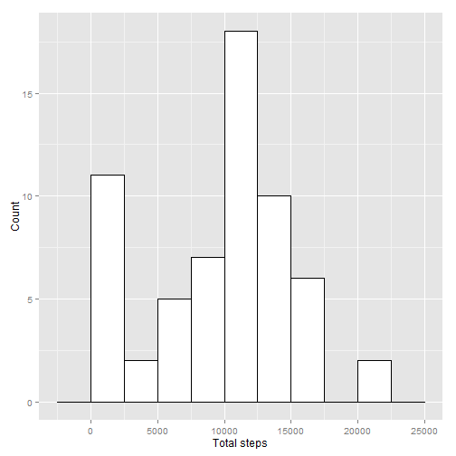
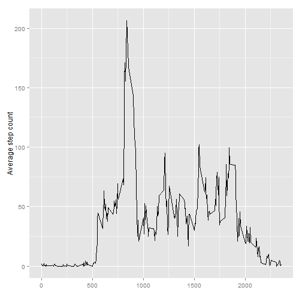
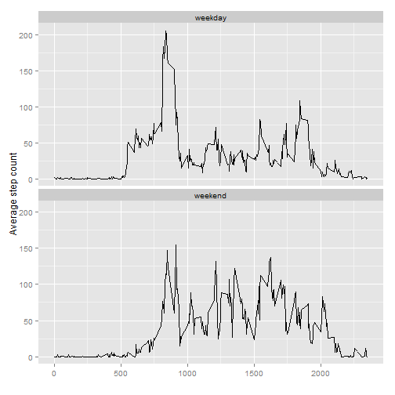

## Loading and preprocessing the data
Loading the data: data is stored in the variable `activity_data`

```r
if (!file.exists('activity.csv')) {
  unzip('activity.zip')
}

activity_data <- read.csv('activity.csv')
```

Preprocessing the data with the following steps
- Turn `date` into dates


```r
activity_data$date <- as.Date(activity_data$date)
```

## What is mean total number of steps taken per day?
First, calculate the summary of statistics that we'll use for the chart.

```r
library(dplyr, warn.conflicts=FALSE)
totals <-activity_data %>%
          group_by(date) %>%
          select(steps) %>%
          summarise(step_count = sum(steps, na.rm = TRUE))

mean_steps <- mean(totals$step_count)
median_steps <- median(totals$step_count)
```

Display the chart


```r
library(ggplot2)
ggplot(totals, aes(x=step_count)) +
    geom_histogram(binwidth=2500, colour="black", fill="white") +
    xlab("Total steps") + ylab("Count")
```

 

The mean of the number of steps in a day is 9354.2295082 and the median is 10395.

## What is the average daily activity pattern?

Start by calculating the statistics that we'll use to show the average daily activity chart.


```r
totals <-activity_data %>%
          group_by(interval) %>%
          select(steps) %>%
          summarise(step_mean = mean(steps, na.rm = TRUE))

ggplot(totals, aes(interval, step_mean)) + geom_line() +
  xlab("") + ylab("Average step count")
```

 

```r
max_index <- which.max(totals$step_mean)
max_interval <- totals$interval[max_index]
interval_time <- strftime(strptime('00:00', format='%H:%M') + as.difftime(max_interval, unit='mins'), '%H:%M')
```

The interval with the maximum average number of steps is 835 which corresponds to a time of 13:55.

## Imputing missing values


```r
missing_count <- sum(is.na(activity_data$steps))
```

There are 2304 missing values in the steps column.

We'll fill them in with the median for that time interval.


```r
medians <-activity_data %>%
          group_by(interval) %>%
          select(steps) %>%
          summarise(step_median = median(steps, na.rm = TRUE))

imputed_activities <- activity_data
imputed_activities$steps <- replace(imputed_activities$steps, is.na(imputed_activities$steps), medians$step_median)
```


Now that we have these values, calculate and display statistics about them.


```r
totals <-imputed_activities %>%
          group_by(date) %>%
          select(steps) %>%
          summarise(step_count = sum(steps, na.rm = TRUE))

new_mean_steps <- mean(totals$step_count)
median_steps <- median(totals$step_count)

ggplot(totals, aes(x=step_count)) +
    geom_histogram(binwidth=2500, colour="black", fill="white") +
    xlab("Total steps") + ylab("Count")
```

 

The mean number of steps per day is 9503.8688525 and the median number of steps per day is 10395. The mean value was slightly changed, from 9354.2295082 to 9503.8688525, while the median value was unchanged by replacing the missing values.

## Are there differences in activity patterns between weekdays and weekends?

First, we'll define a helper function so that we can just pass the date directly to the function. Then, we'll call the function, using dplyr to add the column.

Note that we need to set the locale so that we can check for the value in the list of English day names without needing to worry what the system language is.


```r
Sys.setlocale("LC_TIME", "English")
```

```
## [1] "English_United States.1252"
```

```r
day_type <- function(date) {
  ifelse(weekdays(date) %in% c("Saturday", "Sunday"), 'weekend', 'weekday')
}

imputed_activities <- imputed_activities %>% mutate(day_kind = day_type(date))
imputed_activities$day_kind <- as.factor(imputed_activities$day_kind)

totals <- imputed_activities %>%
            group_by(day_kind, interval) %>%
            select(steps) %>%
            summarise(step_mean = mean(steps))

ggplot(totals, aes(interval, step_mean)) + geom_line() +
  xlab("") + ylab("Average step count") + facet_wrap(~day_kind, nrow=2)
```

 
